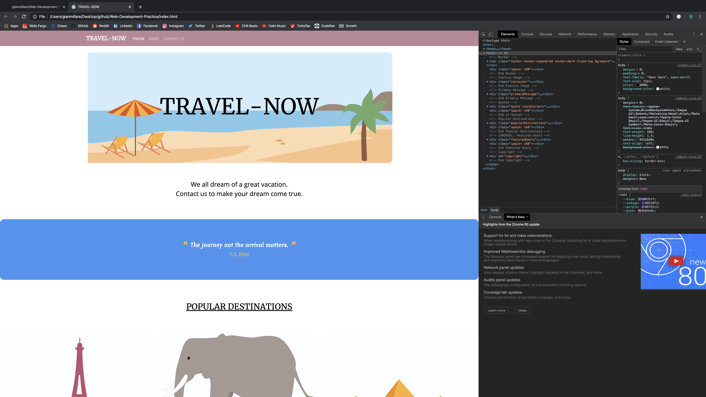
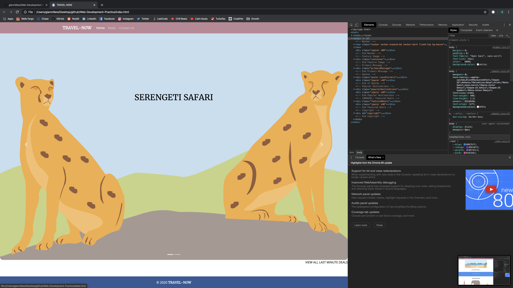
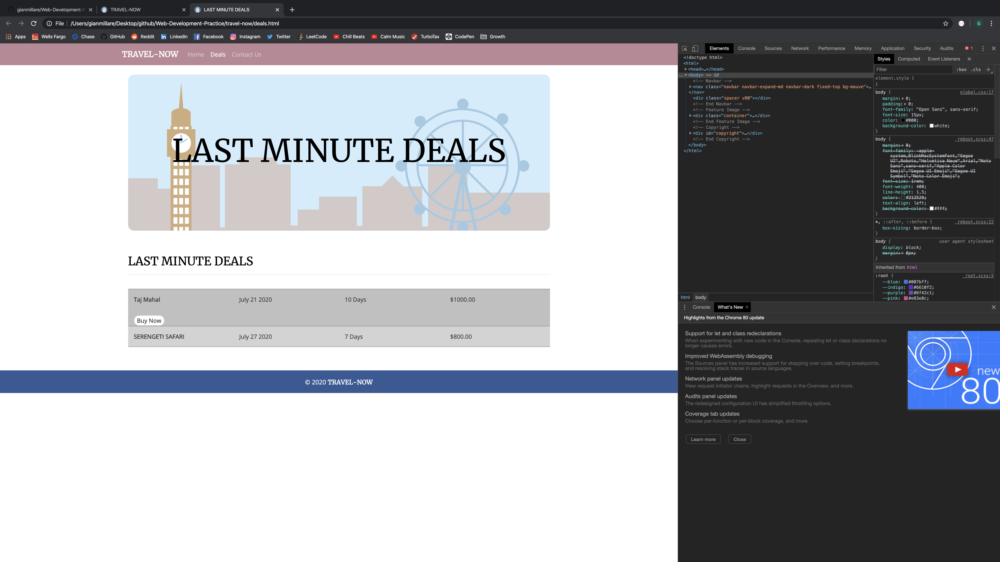

# Web-Development-Practice

------------------------------------------------------------------------------------------------------------

Difficulty: Intermediate

This web development project is from "Beginner's Step-by-Step Coding Course", written by DK Pub. This is a continuation of my career in software development and programming, following my graduation and certification from UC Berkeley's Data Analytics Extension Program. I felt that this project can help hone some of the fundamentals of programming in HTML, CSS, and JavaScript.

Although I have had ample experience in web-styled programming, I wanted to ensure that I absorbed all skills in web development to it's most minute detail. This mini-project's difficulty is set at intermediate because some of the coding techniques and syntax is already known. However, the main objective of undergoing this project was to ensure my web development skills stay on par with what I learned through the Data Analytics program.

 

### Below are images of the website's completion. The final form of the application uses coding techniques from HTML, CSS, and Javascript. 

 

### Below are images of the landing page (home page)

 

 

### Below is a preview of the second web page hosting the "Last Minute Deals" introduced in the Home Page

 

### Below are images of the code used to create the web page(s). The coding languages used (as mentioned before) are HTML, CSS, and JavaScript

 

